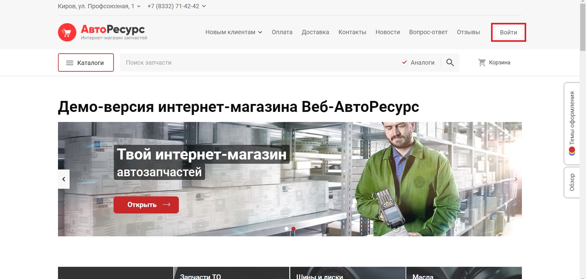
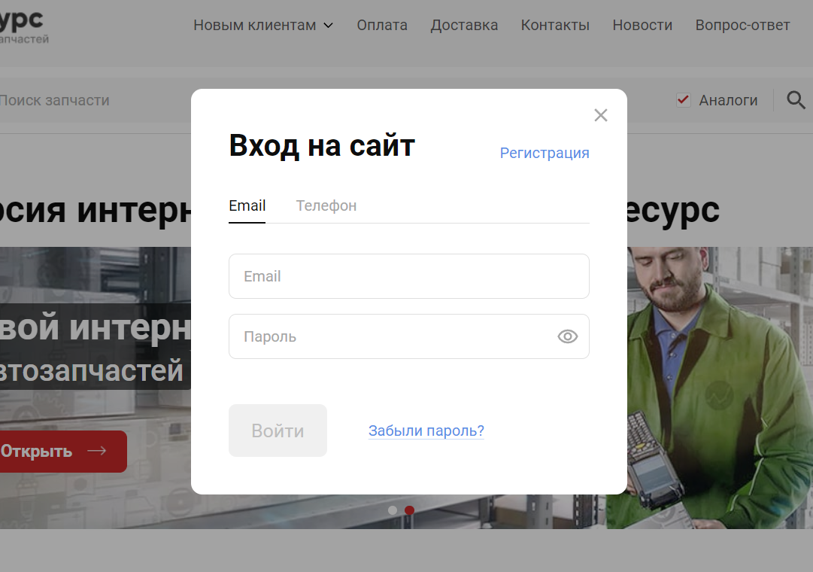
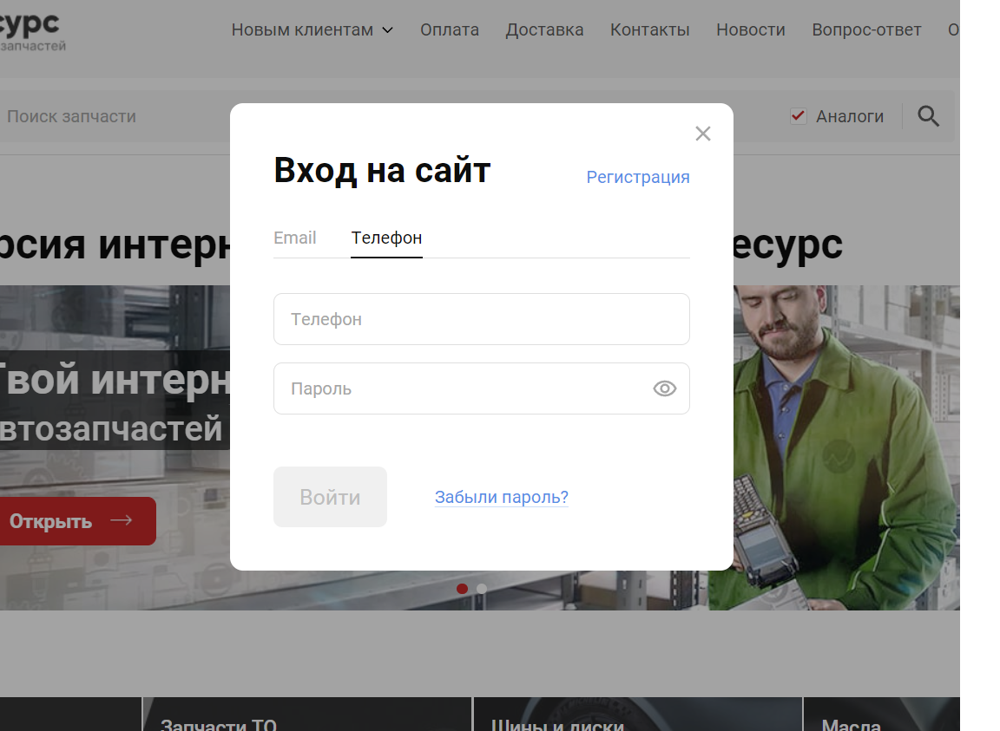
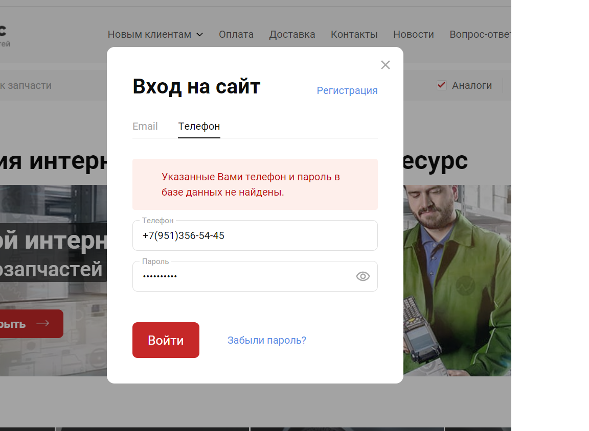
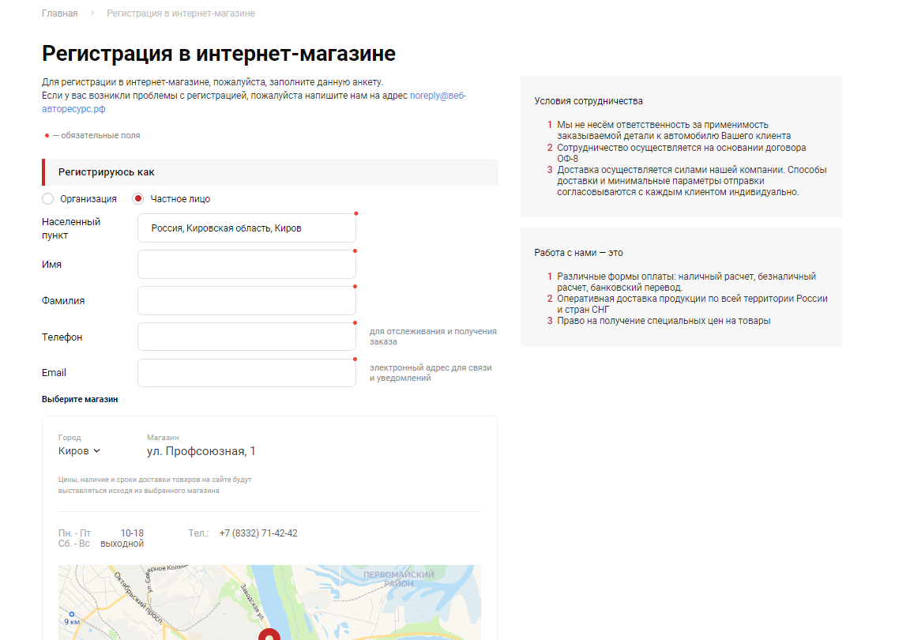
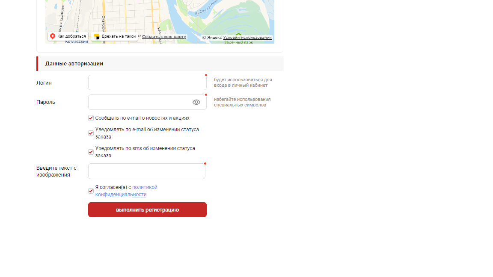
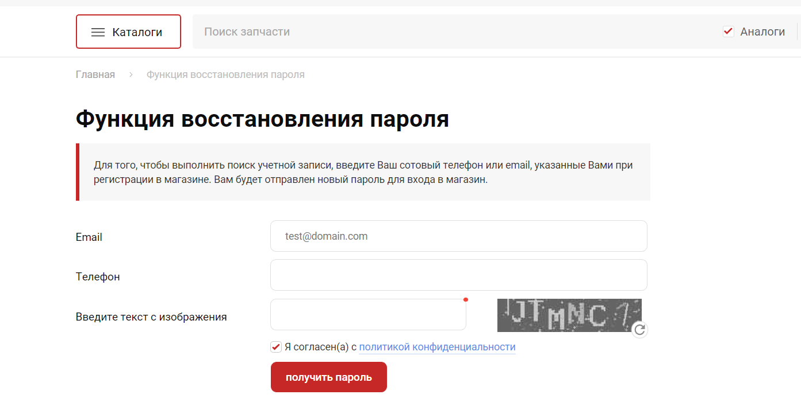

# Авторизация
### Пользователь может выполнить авторизацию на главной странице сайте с помощью формы авторизации на которую можно перейти, нажав на кнопку «Войти». 
### На рисунке 1 показана главная страница сайта.

### На форме авторизации есть два способа входа при помощи электронной почты или номера телефона, указанные при регистрации.
### Первый способ при помощи электронной почты. Форма авторизации содержит:
* Текстовое поле для ввода электронной почты, указанной при регистрации.
* Текстовое поле для ввода пароля, указанном при регистрации.
* Кнопка отправки формы «Войти».
* Ссылка «Забыли пароль».
* Ссылка «Регистрация»
### Форма авторизации при помощи электронной почты показана на рисунке 2.

### Второй способ при помощи номера телефона. Форма авторизации содержит:
* Текстовое поле для ввода номера телефона, указанном при регистрации.
* Текстовое поле для ввода пароля, указанном при регистрации.
* Кнопка отправки формы «Войти».
* Ссылка «Забыли пароль».
* Ссылка «Регистрация»
### Форма авторизации при помощи номера телефона показана на рисунке 3.

### При неудачной попытке авторизации – появляется уведомление, что данные не найдены и нужно заново ввести данные.
### Неудачная попытка авторизации показана на рисунке 4.

### При помощи ссылки «Регистрация» можно зарегистрироваться на сайте. Для этого необходимо нажать на ссылку «Регистрация», чтобы перейти на форму регистрации. Поля, выделенные красной звёздочкой обязательны для заполнения.
### Форма регистрации содержит:
* Ячейки для выбора типа организации
* Текстовое поле для ввода населенного пункта.
* Текстовое поле для ввода имени.
* Текстовое поле для ввода фамилии.
* Текстовое поле для ввода телефона.
* Текстовое поле для ввода почты.
* Текстовое поле для ввода логина.
* Текстовое поле для ввода пароля.
* Текстовое поле для ввода капчи.
* Карта для выбора адреса магазина.
* 4 ячейки о согласии.
* Кнопка отправки формы «Выполнить регистрацию».
* Информация «Условия сотрудничества»
* Информация «Работа с нами – это»
### Форма регистрации показана на рисунках 5 и 6.

### После успешного заполнения формы регистрация можно авторизоваться на сайте.
### При помощи ссылки «Забыли пароль» можно восстановить утерянный пароль. Для этого необходимо нажать на ссылку «Забыли пароль», чтобы перейти на форму восстановления пароля.
### Форма восстановления пароля содержит:
* Текстовое поле для ввода почты, указанной при регистрации.
* Текстовое поле для ввода номера телефона указанном при регистрации.
* Текстовое поле для ввода капчи.
* Ячейка для согласия.
* Кнопка отправки формы «Получить пароль».
### Форма восстановления пароля показана на рисунке 7.

### После успешного заполнения формы восстановления пароля, на указанную почту придёт письмо с новым паролем.
